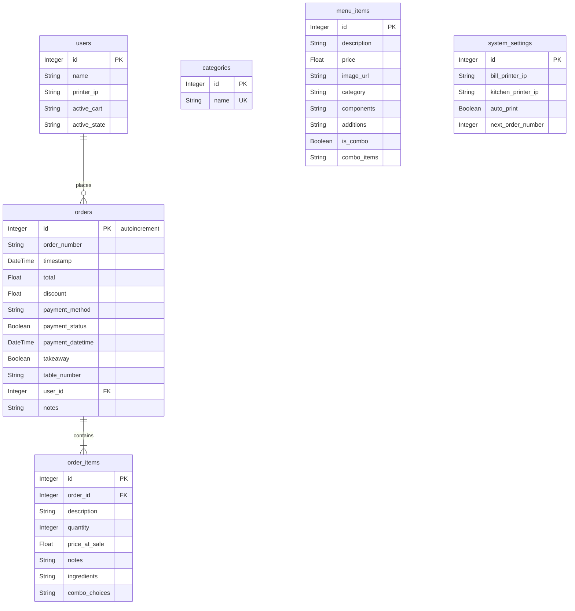

# Database Schema

The system uses a SQLite database (`orders.db`) managed via SQLAlchemy. Below is the explicit schema of all tables, their columns, and the relationships between them.

## Entity-Relationship Diagram

---

## Tables Definition

### `users`
Stores information about the system operators (staff) and their current POS state.
* **id** `Integer` - Primary Key
* **name** `String` - Name of the operator
* **printer_ip** `String` - IP address of the operator's specific printer (legacy/optional depending on setup)
* **active_cart** `String` - JSON string representing the operator's current cart state (Default: `"[]"`)
* **active_state** `String` - JSON string representing the operator's current UI state, like selected table and discount (Default: `"{}"`)

### `categories`
Stores the menu categories (e.g., panini, dolci, bibite).
* **id** `Integer` - Primary Key
* **name** `String` - Name of the category (Unique)

### `menu_items`
Stores all available items and combos that can be ordered from the POS.
* **id** `Integer` - Primary Key
* **description** `String` - Name/Description of the item
* **price** `Float` - Base price of the item
* **image_url** `String` - Path or URL to the item's image
* **category** `String` - The category name this item belongs to (Default: `"burgers"`)
* **components** `String` - Comma-separated list of base ingredients (Default: `""`)
* **additions** `String` - Comma-separated list of optional additions (Default: `""`)
* **is_combo** `Boolean` - Flag indicating if this item is a combo menu (Default: `False`)
* **combo_items** `String` - JSON string of available combo slots and choices (Default: `"[]"`)

### `system_settings`
Stores global POS settings. Typically contains a single row (id=1).
* **id** `Integer` - Primary Key
* **bill_printer_ip** `String` - IP address of the receipt/bill printer
* **kitchen_printer_ip** `String` - IP address of the kitchen printer
* **auto_print** `Boolean` - Flag indicating if receipts should be printed automatically on checkout (Default: `True`)
* **next_order_number** `Integer` - The next consecutive order number to be assigned (Default: `1`)

### `orders`
Stores completed or parked orders.
* **id** `Integer` - Primary Key, Autoincrement
* **order_number** `String` - The human-readable order number, usually sequential (Default: `""`)
* **timestamp** `DateTime` - UTC time when the order was created (Default: `datetime.datetime.utcnow`)
* **total** `Float` - Final total price of the order (after discounts)
* **discount** `Float` - Amount of discount applied
* **payment_method** `String` - Method of payment (e.g., 'Cash', 'Satispay')
* **payment_status** `Boolean` - True if paid, False if waiting for payment (Default: `False`)
* **payment_datetime** `DateTime` - UTC time when the order was paid (Nullable)
* **takeaway** `Boolean` - Flag indicating if the order is for takeaway
* **table_number** `String` - The table number associated with the order (e.g., "1", "A", "Nessuno")
* **user_id** `Integer` - Foreign Key linking to `users.id`
* **notes** `String` - Global notes for the entire order (Default: `""`)

### `order_items`
Stores the individual items that belong to an order.
* **id** `Integer` - Primary Key
* **order_id** `Integer` - Foreign Key linking to `orders.id`
* **description** `String` - Description of the item sold
* **quantity** `Integer` - Quantity sold
* **price_at_sale** `Float` - The actual price charged for the item at the time of sale
* **notes** `String` - Specific notes for this item
* **ingredients** `String` - String representation of the modified ingredients
* **combo_choices** `String` - String representation of the chosen combo options (Default: `""`)

---

## Relationships

1. **User ↔ Order** (One-to-Many)
   * A `User` can place multiple `Order`s.
   * Defined by `orders.user_id` referencing `users.id`.
2. **Order ↔ OrderItem** (One-to-Many)
   * An `Order` contains one or more `OrderItem`s.
   * Defined by `order_items.order_id` referencing `orders.id`.
   * Accessible in SQLAlchemy via the `order.items` relationship attribute.
